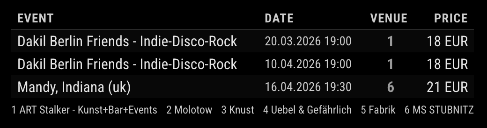

# MMM-Eventim

MagicMirror² module that displays the events and concerts of the next 30 days from Eventim.

The Eventim API doc is described here: https://gist.github.com/DeveloperMarius/7e8aff4c69ccbf59238d76163c86d9c9

## Preview


## Installation
Navigate into your MagicMirror's `modules` folder:
```
cd ~/MagicMirror/modules
```

Clone this repository:
```
git clone https://github.com/kodejak/MMM-Eventim 
```

Configure the module in your `config.js` file.

## Configuration

To use this module, add it to the modules array in the `config/config.js` file:

```javascript
{
    module: "MMM-Eventim",
    position: "top_right",
    config: {
      updateInterval: 60 * 1000,
      animationSpeed: 1000,
      maxItems: 10,
      language: "de",
      cities: ["Berlin"],
      categories: ["Konzerte"],
      searchTerm: "Indie",
      inStock: true,
      showPrice: true,
      showVenue: true,
      venues: ["Molotow", "Knust", "Uebel & Gefährlich"],
    }
}
```

### Configure options

| Option | Description | Default | Comment
|---|---|---|---|
| `updateInterval` | Polling interval | `60000` (60 seconds) | milliseconds |
| `animationSpeed` | DOM fade transition speed in ms | `1000` | milliseconds |
| `maxItems` | Maximum number of events to display | `10` | max. 50 |
| `language` | Language code like `de` or `en` | "de" | required |
| `cities` | City names like `Hamburg` or `London` | ["Berlin"] | string array, optional |
| `categories` | Categories like `Concerts` | "Konzerte" | string array, optional |
| `searchTerm` | text & context search like `Indie`| "Indie" | optional |
| `showPrice`| Show price in list | true | optional |
| `showVenue`| Show venue in list | true | optional |
| `inStock`| Show event only, when tickets are available | true | optional |
| `venues` | Shows only venues that are defined | [] | string array, optional |
